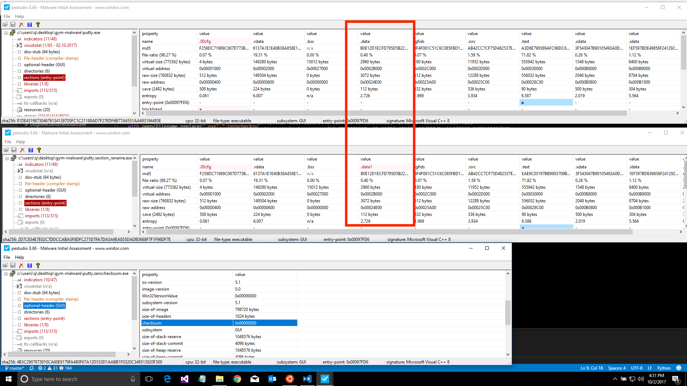

# mutateEXE
A fork of [Endgame's gym-malware](https://github.com/endgameinc/gym-malware) manipulate2.py.

# Purpose
I wanted to a way to mutate PE (exe) files in such a way that it will still remain functional for the purpose of testing endpoint security products, particularly the so call next-generation machine/deep learning based products.

# Relevant Work
I chanced upon Dr Hyrum Anderson's [presentation @ DEF-CON - Evading next-gen AV using A.I](https://media.defcon.org/DEF%20CON%2025/DEF%20CON%2025%20presentations/DEFCON-25-Hyrum-Anderson-Evading-Next-Gen-AV-Using-AI.pdf) & within his work, the ability to mutate the PEs but maintain functionality is exactly what I was looking for.

# Problems Encountered
[LIEF](https://lief.quarkslab.com) has some [parsing issue](https://github.com/endgameinc/gym-malware/issues/1) as eluded by Dr Hyrum. Somehow, **every EXE** I loaded into a byte-list will always fail to parse with **lief.PE.parse()** function. I tested in both OSX & Windows10 with native Bash integration.

As Dr Hyrum responded with **his example codes without his PE modification**, the resultant file rebuilt by LIEF was also broken. In his environment, only some files are affected; those that are malformed to begin with, which can be common for malware samples.

So I went to hack the script to load via filename string, parsing sort-of work. Unfortunately, for my case, **ALL the rebuild PEs will end up as "brick" files which cannot be executed**. 

# Work Arounds
## Parsing
After looking at Quarkslab documentation, I realized the parse function has overloads. Changing the PE parse calls within [manipulate2.py](manipulate2.py) to lief.PE.parse(self.bytez, **name=''**) solves my totally unable to parse any EXE issue. This eliminate the possibility of overload call confusion.

## PE Building
The original [__binary_to_bytez](https://github.com/endgameinc/gym-malware/blob/c51438384323d286ceb0f6f526f24263e09b6277/gym_malware/envs/controls/manipulate2.py#L36) will always call build.build_* functions even if the various flags are false. After glancing through Quarkslab docs, it seems those functions will rebuild the various structures within the given PE. 

It seems to be unnecessary if we only want to change sections, zero-out checksum & remove certificate within the PE. After generating the mutate files, I used a PE analysis tool to check the deltas:

# Installation
Please follow [Endgame's gym-malware](https://github.com/endgameinc/gym-malware) instruction to get LIEF lib & Python bindings to work first. 

# Usage
I highly suggest the use of Windows 10 with Bash integration for doing such development & testing. If you are mutating malicious PEs, **you should probably run ["removeInvalidPE.ps1"](removeInvalidPE.ps1) within a test Windows VM** with Powershell to delete away all the invalid executable-files

# Observations
* I mutated 4 Win32 GUI PEs with the mutation actions within mutate.py so far & the resultant files tend to work fine. 

* Win32 console PEs are more unpredictable, so I wrote a Powershell to remove the invalid output mutated files

* So far, most of the Windows native EXEs I lifted from C:\Windows\System32 will tend to break after mutation. 